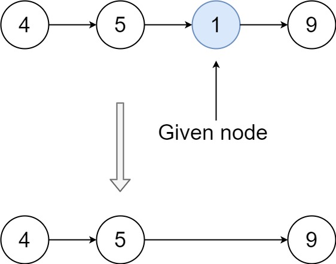

# [237. 删除链表中的节点](https://leetcode.cn/problems/delete-node-in-a-linked-list/)


## 题目

有一个单链表的 `head`，我们想删除它其中的一个节点 `node`。

给你一个需要删除的节点 `node` 。你将 **无法访问** 第一个节点 `head`。

链表的所有值都是 **唯一的**，并且保证给定的节点 `node` 不是链表中的最后一个节点。

删除给定的节点。注意，删除节点并不是指从内存中删除它。这里的意思是：

- 给定节点的值不应该存在于链表中。
- 链表中的节点数应该减少 1。
- `node` 前面的所有值顺序相同。
- `node` 后面的所有值顺序相同。

**自定义测试：**

- 对于输入，你应该提供整个链表 `head` 和要给出的节点 `node`。`node` 不应该是链表的最后一个节点，而应该是链表中的一个实际节点。
- 我们将构建链表，并将节点传递给你的函数。
- 输出将是调用你函数后的整个链表。

 

**示例 1：**


```
输入：head = [4,5,1,9], node = 5
输出：[4,1,9]
解释：指定链表中值为 5 的第二个节点，那么在调用了你的函数之后，该链表应变为 4 -> 1 -> 9
```

**示例 2：**



```
输入：head = [4,5,1,9], node = 1
输出：[4,5,9]
解释：指定链表中值为 1 的第三个节点，那么在调用了你的函数之后，该链表应变为 4 -> 5 -> 9
```

 

**提示：**

- 链表中节点的数目范围是 `[2, 1000]`
- `-1000 <= Node.val <= 1000`
- 链表中每个节点的值都是 **唯一** 的
- 需要删除的节点 `node` 是 **链表中的节点** ，且 **不是末尾节点**


## 题解

```cpp
class Solution
{
public:
    void deleteNode(ListNode *node)
    {
        ListNode *toDelete = node->next; // 保存待删除的节点
        node->val = toDelete->val;       // 复制值
        node->next = toDelete->next;     // 跳过待删除节点
        delete toDelete;                 // 释放内存
    }
};
```


## points

1. 太神秘了。题目：删除，但是只给你要删的这个结点。那就直接把下一个结点copy过来，把下一个结点删除掉

2. 在释放内存的时候，需要创建一个指向下一个结点的指针，操作完毕后，delete它，这样才能释放掉占用的内存。函数传参`ListNode *node`是按值传递的，是一个指向node对象的指针

3. 临时指针是用来保存要删除对象地址的，这样在操作之后，仍然能够定位到这一块内存，从而可以删除

4. _key解法，巧妙地利用了结构体 或 类的 浅拷贝（swallow copy）特性，直接覆盖当前结点的内容，从而达到删除结点的效果

   在赋值的时候，C++逐个成员进行拷贝