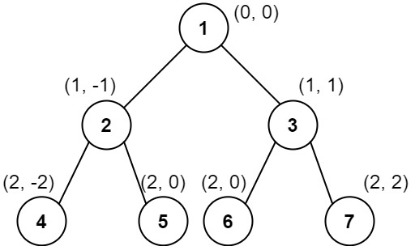

# [987. 二叉树的垂序遍历](https://leetcode.cn/problems/vertical-order-traversal-of-a-binary-tree/)


## 题目

给你二叉树的根结点 `root` ，请你设计算法计算二叉树的 **垂序遍历** 序列。

对位于 `(row, col)` 的每个结点而言，其左右子结点分别位于 `(row + 1, col - 1)` 和 `(row + 1, col + 1)` 。树的根结点位于 `(0, 0)` 。

二叉树的 **垂序遍历** 从最左边的列开始直到最右边的列结束，按列索引每一列上的所有结点，形成一个按出现位置从上到下排序的有序列表。如果同行同列上有多个结点，则按结点的值从小到大进行排序。

返回二叉树的 **垂序遍历** 序列。

 

**示例 1：**


```
输入：root = [3,9,20,null,null,15,7]
输出：[[9],[3,15],[20],[7]]
解释：
列 -1 ：只有结点 9 在此列中。
列  0 ：只有结点 3 和 15 在此列中，按从上到下顺序。
列  1 ：只有结点 20 在此列中。
列  2 ：只有结点 7 在此列中。
```

**示例 2：**



```
输入：root = [1,2,3,4,5,6,7]
输出：[[4],[2],[1,5,6],[3],[7]]
解释：
列 -2 ：只有结点 4 在此列中。
列 -1 ：只有结点 2 在此列中。
列  0 ：结点 1 、5 和 6 都在此列中。
          1 在上面，所以它出现在前面。
          5 和 6 位置都是 (2, 0) ，所以按值从小到大排序，5 在 6 的前面。
列  1 ：只有结点 3 在此列中。
列  2 ：只有结点 7 在此列中。
```

**示例 3：**


```
输入：root = [1,2,3,4,6,5,7]
输出：[[4],[2],[1,5,6],[3],[7]]
解释：
这个示例实际上与示例 2 完全相同，只是结点 5 和 6 在树中的位置发生了交换。
因为 5 和 6 的位置仍然相同，所以答案保持不变，仍然按值从小到大排序。
```

 

**提示：**

- 树中结点数目总数在范围 `[1, 1000]` 内
- `0 <= Node.val <= 1000`


## 题解

```cpp
/**
 * Definition for a binary tree node.
 * struct TreeNode {
 *     int val;
 *     TreeNode *left;
 *     TreeNode *right;
 *     TreeNode() : val(0), left(nullptr), right(nullptr) {}
 *     TreeNode(int x) : val(x), left(nullptr), right(nullptr) {}
 *     TreeNode(int x, TreeNode *left, TreeNode *right) : val(x), left(left), right(right) {}
 * };
 */
class Solution
{
    // 不写private默认就是
    map<int, vector<pair<int, int>>> groups;

    void dfs(TreeNode *node, int row, int col)
    {
        if (node == nullptr)
            return;
        groups[col].emplace_back(row, node->val);
        dfs(node->left, row + 1, col - 1);
        dfs(node->right, row + 1, col + 1);
    }

public:
    vector<vector<int>> verticalTraversal(TreeNode *root)
    {
        // 先dfs获取所有的组，按(col, row, val)为一组
        // 之后从第一列到最后一列，对同一col内(row, val)排序，先row后val
        // 按顺序把值粘贴到答案vector里
        // 最后返回的是一个序列
        dfs(root, 0, 0);
        vector<vector<int>> ans;
        for (auto &[_, g] : groups)
        {
            ranges::sort(g);
            vector<int> vals;
            for (auto &[_, val] : g)
            {
                vals.push_back(val);
            }
            ans.push_back(vals);
        }
        return ans;
    }
};
```


## points

1. 先dfs获取所有的组，按(col, row, val)为一组

2. 之后从第一列到最后一列，对同一col内(row, val)排序，先row后val

3. 按顺序把值粘贴到答案vector里
4. 最后返回的是一个序列